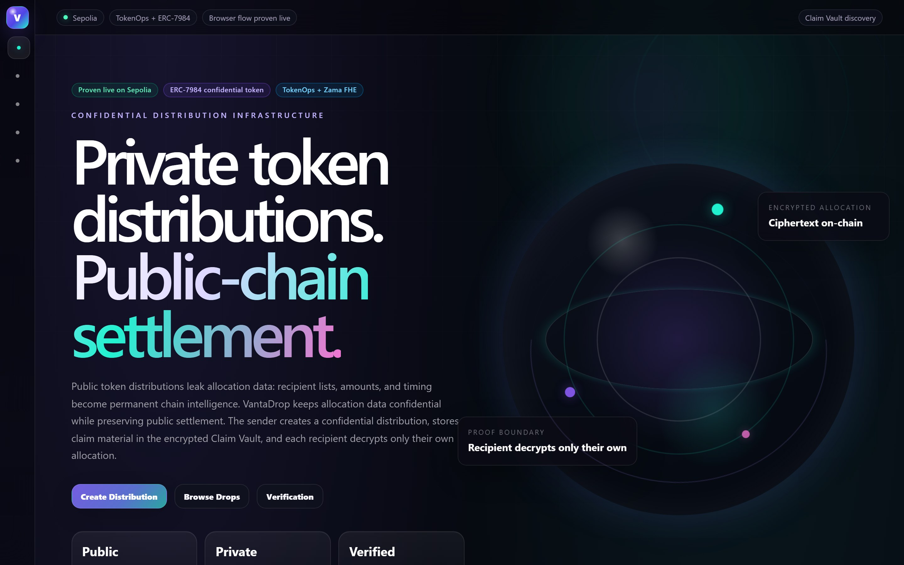
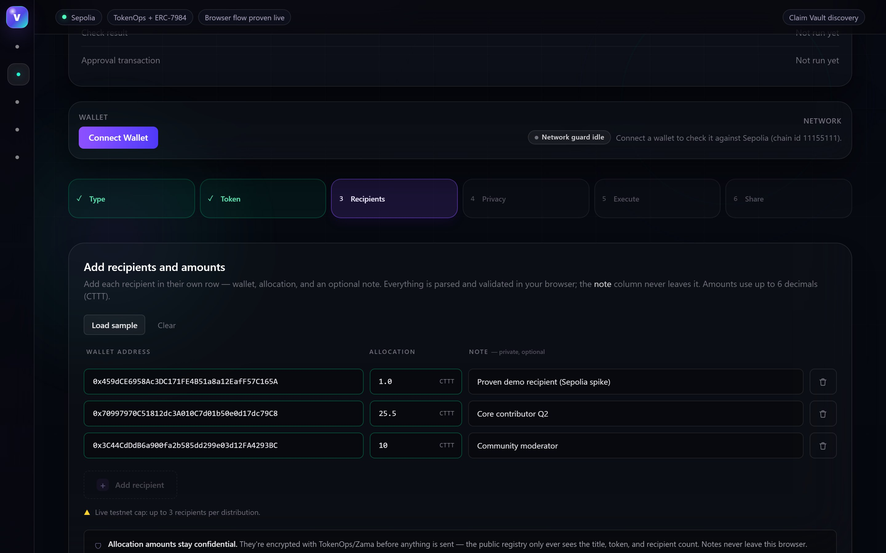
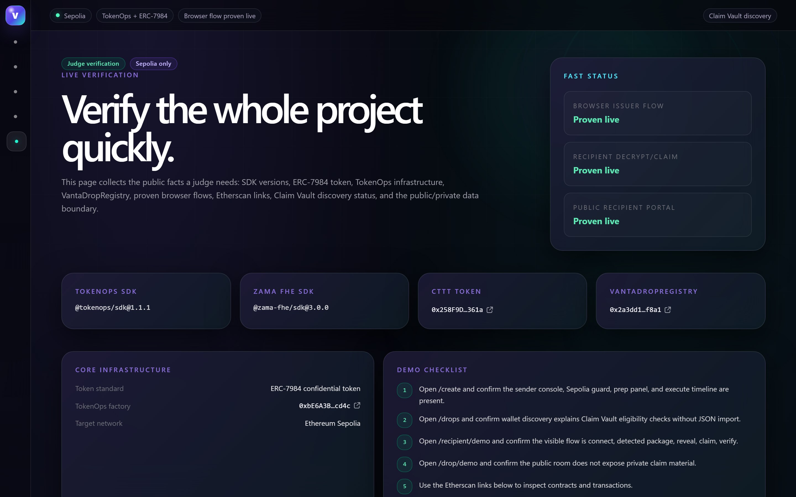

# VantaDrop

[](https://www.zama.ai/)
[](https://www.npmjs.com/package/@tokenops/sdk)
[](https://sepolia.etherscan.io/)
[](https://eips.ethereum.org/EIPS/eip-7984)
[](#license)

**Zama Developer Program · Season 3 · Special Bounty Track with TokenOps**

Confidential token distributions for teams, investors, and communities — allocation amounts stay encrypted end-to-end, while settlement stays on the public chain.

**Live app:** https://vantadrop.xyz

**Watch the demo:** https://www.youtube.com/watch?v=n6EOP0-EqT8

<sub>The original deployment at https://vantadrop.vercel.app also still resolves as a fallback.</sub>

VantaDrop is a frontend for confidential token distribution (airdrops, disperse, vesting) built on [`@tokenops/sdk`](https://www.npmjs.com/package/@tokenops/sdk), which wraps Zama's FHEVM protocol and OpenZeppelin's [ERC-7984](https://eips.ethereum.org/EIPS/eip-7984) confidential fungible token standard. A sender creates and funds a confidential distribution, claim material is held in an encrypted Claim Vault, and each recipient decrypts and claims **only their own** allocation — no allocation amount is ever visible on-chain to anyone but its recipient.



---

## Table of Contents

- [Problem](#problem)
- [Why confidential tokens matter](#why-confidential-tokens-matter)
- [How it works](#how-it-works)
  - [For the sender](#for-the-sender)
  - [For the recipient](#for-the-recipient)
- [Live Proof on Sepolia](#live-proof-on-sepolia)
- [Deployed Contracts](#deployed-contracts)
- [Privacy Model](#privacy-model)
- [Architecture](#architecture)
- [Routes](#routes)
- [Local Development](#local-development)
- [Known Limitations](#known-limitations)
- [Security](#security)
- [License](#license)

---

## Problem

Public token distributions leak allocation data. The moment an airdrop, disperse, or vesting campaign settles on a transparent chain, the recipient list, the exact amount each address received, and the timing all become permanent, queryable chain intelligence. Anyone can reconstruct who got how much, rank contributors, front-run unlocks, or target the largest recipients. For payroll, investor allocations, contributor rewards, and community grants, that transparency is a liability, not a feature.

## Why confidential tokens matter

ERC-7984 confidential fungible tokens hold balances as fully-homomorphically-encrypted (FHE) ciphertext on-chain, using Zama's FHEVM. Values can be transferred and settled without ever being decrypted publicly — only the holder (and parties they explicitly grant access to) can decrypt their own balance. VantaDrop applies this to distribution: it preserves the auditable, public-chain settlement guarantees teams want, while keeping the sensitive part — *who gets how much* — confidential. Public observers see that a distribution happened and how many recipients it had; they never see the amounts.

## How it works

The sender and recipient never exchange a file by hand. The sender creates a confidential distribution, its claim material is stored as encrypted capsules in VantaDrop's Claim Vault, and recipients discover and claim their allocation from their own wallet. The public [`VantaDropRegistry`](#deployed-contracts) records only public metadata (title, use case, token, airdrop contract, recipient count) — never recipient lists or amounts.

### For the sender

A guided six-step wizard on [`/create`](https://vantadrop.xyz/create): choose a distribution type and title, pick the ERC-7984 token (CTTT by default), enter recipients as rows (**Wallet / Allocation / Note**), review the privacy model, then execute. Execution runs the real TokenOps/Zama sequence from the browser — operator approval, per-recipient encryption, claim-authorization signing, create-and-fund, public metadata registration, and encrypted Claim Vault storage — each step gated behind an explicit action with a live status timeline. Recipient amounts are encrypted in-flight; the private `note` column never leaves the browser.



### For the recipient

Recipients open [`/drops`](https://vantadrop.xyz/drops), connect their wallet, and privately check eligibility. Eligibility is a harmless wallet-signature challenge (no gas) that verifies wallet ownership against the encrypted Claim Vault; a matching capsule is released only to the matching wallet. From there the recipient portal walks them through reveal (eligibility check → decrypt-access grant → decrypt), claim (single-use, irreversible), and post-claim balance verification — with the decrypted allocation shown only to them, only in their browser.


## Live Proof on Sepolia

The full confidential-distribution lifecycle has been proven live on Sepolia with real transactions — issuer create/fund, recipient decrypt-verify, and claim, with the decrypted allocation matching the sender-encrypted amount exactly. The [`/verification`](https://vantadrop.xyz/verification) page collects the public facts a judge needs (SDK versions, token, infrastructure, Etherscan links, and the public/private data boundary) in one place.



Reference transactions from the proven Sepolia run (against airdrop clone [`0x8cFE4cab5A3ca843B94B1A4765D6DA780547ee14`](https://sepolia.etherscan.io/address/0x8cFE4cab5A3ca843B94B1A4765D6DA780547ee14), 1 recipient, decrypted allocation `1.0 CTTT`):

| Step | Transaction |
| --- | --- |
| Mint confidential test tokens | [`0x2e4b4d06…3ad69`](https://sepolia.etherscan.io/tx/0x2e4b4d06a232770a5db5de15094ae76ff9b0df4f3f48542ee915dc403153ad69) |
| Create + fund confidential airdrop | [`0x7ec47177…44578`](https://sepolia.etherscan.io/tx/0x7ec47177768fad44fc975a7d79b1c58b2fb18c45828acf573d42b08d8d744578) |
| Grant decrypt access (`getClaimAmount`) | [`0xc635b966…c48c0`](https://sepolia.etherscan.io/tx/0xc635b966543fe1226f27bced74a3016046b773e554a98a407cdbd73fac6c48c0) |
| Claim allocation | [`0xd9790e67…d70f24`](https://sepolia.etherscan.io/tx/0xd9790e674fea8394b3ad8378aadb6aceff069ebcc6916cc72831550529d70f24) |
| `VantaDropRegistry` deploy | [`0xf60cb789…49c0c`](https://sepolia.etherscan.io/tx/0xf60cb789dc0119a9ea69fe267871788d68b0d47014c7b342356ed6f236a49c0c) |

Full details, additional transaction hashes, and the account-object bug found and fixed along the way are documented in [`docs/research/tokenops-sdk-notes.md`](docs/research/tokenops-sdk-notes.md) ("Live Sepolia Runtime Spike Result") and [`docs/research/browser-tokenops-integration.md`](docs/research/browser-tokenops-integration.md) (live browser checkpoints). [`scripts/spike-tokenops-sepolia.ts`](scripts/spike-tokenops-sepolia.ts) is the canonical, proven SDK integration reference the browser flows were built from.

## Deployed Contracts

All on **Ethereum Sepolia** (chain id `11155111`).

| Contract | Address | Role |
| --- | --- | --- |
| `VantaDropRegistry` | [`0x2a3dd1df…5bc5f8a1`](https://sepolia.etherscan.io/address/0x2a3dd1dff5c121b1fc24c7412e519c075bc5f8a1) | Thin, optional public-metadata registry deployed by this project. Stores metadata only. |
| TokenOps `ConfidentialAirdropFactory` | [`0xbE6A3B78…3F5Acd4c`](https://sepolia.etherscan.io/address/0xbE6A3B78B36684fFee48De77d47Bc3393F5Acd4c) | Pre-deployed by TokenOps; consumed as-is. The confidential distribution engine. |
| CTTT token (ERC-7984) | [`0x258F9D60…5377361a`](https://sepolia.etherscan.io/address/0x258F9D60dc023870e4E3109c894D834D5377361a) | TokenOps confidential test token (6 decimals) used in the proven run. |

SDK versions pinned and verified against the installed packages: `@tokenops/sdk@1.1.1`, `@zama-fhe/sdk@3.0.0`.

## Privacy Model

The load-bearing rule: **confidential amounts never touch a database or a log in plaintext.** Only encrypted handles, addresses, timestamps, and public totals are ever persisted or logged.

- **On-chain, amounts are ciphertext only.** Each recipient's allocation exists on Sepolia as FHE ciphertext — no observer, not even VantaDrop, can read it.
- **The public registry stores metadata only.** [`VantaDropRegistry`](#deployed-contracts) records the title, use case, token address, airdrop contract, recipient count, and a metadata URI — and has no field shaped to accept recipient lists, amounts, notes, signatures, or encrypted handles.
- **Claim material is released through the encrypted Claim Vault.** Capsules are stored encrypted at rest and released only after a wallet-ownership signature challenge succeeds for the matching recipient wallet.
- **Notes never leave the browser.** The optional per-recipient `note` is held in browser memory only — never uploaded, never written on-chain, never logged.
- **Each recipient decrypts only their own allocation.** Decrypt access is granted to the recipient's address alone; no one can see anyone else's amount.

## Architecture

- **Frontend:** Next.js 16 (App Router) + React 19, deployed on Vercel. Wallet connectivity via `wagmi` + `viem`.
- **Confidential engine:** [`@tokenops/sdk`](https://www.npmjs.com/package/@tokenops/sdk), which wraps Zama's FHEVM and the `@zama-fhe/sdk` relayer for ERC-7984 confidential tokens (browser encryption, decrypt-access grants, claim, and balance decryption). This project does not deploy or modify any part of the confidential distribution engine.
- **Public metadata contract:** [`contracts/VantaDropRegistry.sol`](contracts/VantaDropRegistry.sol) — a thin, immutable registry for Distribution Room pages, built and tested with Hardhat 3 (`@nomicfoundation/hardhat-toolbox-viem`). See [`docs/research/registry-decision.md`](docs/research/registry-decision.md) for why it exists and why it stores metadata only.
- **Claim Vault:** a server-side encrypted-capsule store (Upstash Redis / Vercel KV) exposed through Next.js API routes, holding encrypted claim capsules and releasing them only after wallet-ownership verification.

## Routes

| Route | Purpose |
| --- | --- |
| [`/`](https://vantadrop.xyz/) | Landing page. |
| [`/create`](https://vantadrop.xyz/create) | Sender console — the six-step confidential distribution wizard. |
| [`/drops`](https://vantadrop.xyz/drops) | Recipient wallet-discovery dashboard (private eligibility checks). |
| [`/recipient/demo`](https://vantadrop.xyz/recipient/demo) | Productized recipient portal — reveal, claim, verify. |
| [`/drop/demo`](https://vantadrop.xyz/drop/demo) | Public Distribution Room / proof page (no private claim material). |
| [`/verification`](https://vantadrop.xyz/verification) | Judge-facing verification page (SDK versions, contracts, Etherscan links). |
| `/api/drops`, `/api/drops/[id]` | Public drop metadata. |
| `/api/claim-vault/{capsules,challenge,lookup}` | Encrypted Claim Vault: store capsules, issue wallet-ownership challenges, release matching capsules. |
| `/dev/recipient-claim-diagnostic`, `/dev/tokenops-diagnostic` | Developer diagnostics — available only in local development; they return **404 in production**. |

## Local Development

Requirements: Node.js and npm.

```bash
npm install          # install dependencies
npm run dev          # start the Next.js dev server (http://localhost:3000)
npm run build        # production build
npm run start        # serve the production build
npm run lint         # ESLint over app, components, lib, next.config.ts
npx hardhat test     # VantaDropRegistry contract tests (test/VantaDropRegistry.ts)
```

The frontend ships with safe public defaults for all on-chain constants (see [`lib/constants.ts`](lib/constants.ts)), so it runs out of the box with zero env setup; addresses can be overridden with `NEXT_PUBLIC_*` variables. The Claim Vault requires Upstash Redis / Vercel KV credentials to persist capsules — without them, the vault reports "not configured" rather than failing silently.

`npm run spike` runs [`scripts/spike-tokenops-sepolia.ts`](scripts/spike-tokenops-sepolia.ts), the canonical live SDK integration reference. It performs real Sepolia transactions and therefore needs a funded burner wallet and the corresponding environment configuration.

> FHE gas/HCU costs and relayer behavior cannot be meaningfully unit-tested locally — real verification requires a funded Sepolia wallet and a live claim/decrypt round trip. The Hardhat suite covers the public `VantaDropRegistry` only.

## Known Limitations

Stated honestly — these are real boundaries of the current build, not oversights.

- **Sepolia only.** `fhe-airdrop` and `fhe-vesting` are Sepolia-only per TokenOps (mainnet pending further audits/pilots); this project builds no mainnet-specific paths for them.
- **Live execution is capped at 3 recipients per distribution** in this phase (a deliberate safety cap; the recipient list is never silently truncated).
- **FHE flows can't be proven by local unit tests.** Gas/HCU costs and relayer behavior require a funded wallet and a live round trip on Sepolia; the automated test suite only covers the public registry contract.
- **Relayer / CDN dependency.** Browser encryption depends on the Zama testnet relayer and a CDN-hosted WASM engine; the first encryption in a browser downloads several MB of FHE parameters and can be slow.
- **The registry is optional public metadata, never the source of truth.** A registry write can fail without affecting the confidential distribution itself.

## Security

- **No plaintext allocation ever persists or logs.** Only encrypted handles, addresses, timestamps, and public totals are stored or logged — a code path that would leak a plaintext allocation is treated as a bug, not a style nit.
- **Claim material is encrypted at rest** in the Claim Vault and released only after an EIP-712 wallet-ownership challenge succeeds for the matching recipient wallet.
- **Private notes never leave the browser.**
- **Developer diagnostics are gated out of production** and return 404 on the live domain.
- **No secrets in the repo.** On-chain constants are public addresses/hashes only; no private keys or `.env` values are committed.

## License

ISC (as declared in [`package.json`](package.json)).
